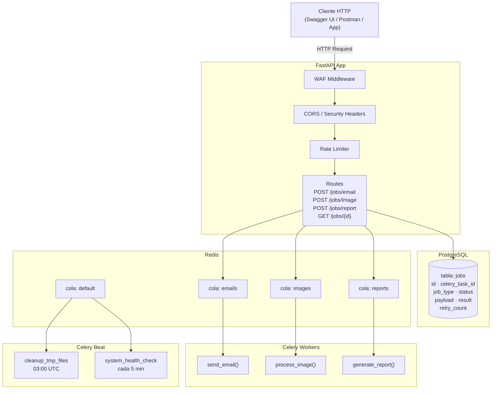
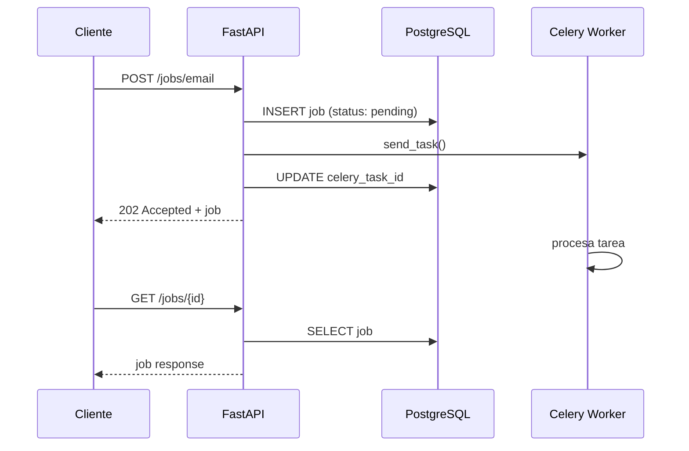

# Task Queue System

Backend asíncrono de procesamiento de tareas construido con Python, Celery y FastAPI. Diseñado con seguridad en todas las capas y orientado a entornos de producción.

---

## Descripción general

El sistema expone una API HTTP que permite encolar tareas de larga duración — envío de emails, procesamiento de imágenes y generación de reportes — para ser procesadas en background por workers independientes. Cada tarea queda registrada en PostgreSQL con su ciclo de vida completo, y el estado puede consultarse en cualquier momento.

---

## Arquitectura



---

## Ciclo de vida de un job



---

## Stack tecnológico

| Componente | Tecnología |
|---|---|
| API | FastAPI + Uvicorn |
| Task Queue | Celery 5 |
| Broker / Backend | Redis 7 |
| Base de datos | PostgreSQL 16 |
| ORM | SQLAlchemy 2 |
| Migraciones | Alembic |
| Validaciones | Pydantic v2 |
| Logging | structlog |
| Monitoreo | Flower |
| Gestor de paquetes | uv |
| Contenedores | Docker + Docker Compose |

---

## Seguridad implementada

**API (capa HTTP)**
- WAF middleware — detecta y bloquea patrones de SQL injection, XSS, path traversal y null bytes en URL, query string y headers
- Rate limiting por IP con límites diferenciados por endpoint
- Políticas CORS configuradas por entorno
- Security headers en todas las respuestas (HSTS, CSP, X-Frame-Options, etc.)
- Validación de Host header contra lista de hosts permitidos
- Límite de tamaño de body (1MB)

**Datos**
- Sanitización de todos los inputs antes de procesamiento
- ORM obligatorio — nunca SQL crudo
- Validación estricta de schemas con Pydantic en cada endpoint
- Whitelist de operaciones permitidas en tareas de imagen
- Validación de paths para prevenir directory traversal

**Infraestructura**
- Redis protegido con contraseña
- Serialización exclusiva en JSON — pickle deshabilitado en Celery
- Variables de entorno para todas las credenciales
- Archivos temporales con nombres hasheados y limpieza automática

---

## Estructura del proyecto

```
task-queue-system/
├── src/
│   ├── api/
│   │   ├── dependencies.py     # Validación de Host header
│   │   └── routes.py           # Endpoints FastAPI con rate limiting
│   ├── core/
│   │   ├── config.py           # Settings con Pydantic (carga desde .env)
│   │   ├── cors.py             # Configuración de políticas CORS
│   │   ├── database.py         # Engine y sesión de SQLAlchemy
│   │   ├── exceptions.py       # Excepciones del dominio
│   │   ├── logging.py          # Logging estructurado con structlog
│   │   ├── rate_limiter.py     # Configuración de slowapi
│   │   ├── security.py         # Sanitización, validación de archivos y paths
│   │   └── security_middleware.py  # WAF y security headers
│   ├── models/
│   │   ├── base.py             # Base declarativa + TimestampMixin
│   │   └── job.py              # Modelo Job con enums JobType y JobStatus
│   ├── monitoring/
│   │   └── health.py           # Health checks de Redis y DB
│   ├── schemas/
│   │   ├── job.py              # Schemas de respuesta
│   │   └── task_payload.py     # Schemas de entrada con validaciones y sanitización
│   ├── services/
│   │   ├── queue_service.py    # Lógica de encolado y consulta de jobs
│   │   └── storage_service.py  # Operaciones seguras sobre el filesystem
│   ├── tasks/
│   │   ├── email_tasks.py      # Tarea de envío de email
│   │   ├── image_tasks.py      # Tarea de procesamiento de imagen
│   │   └── report_tasks.py     # Tarea de generación de reportes + tareas periódicas
│   ├── utils/
│   │   ├── file_utils.py       # Helpers de directorios
│   │   └── validators.py       # Validadores reutilizables (UUID, paginación)
│   └── workers/
│       ├── beat_schedule.py    # Registro de tareas periódicas
│       └── celery_app.py       # Instancia y configuración de Celery
├── migrations/                 # Migraciones Alembic
├── tests/
│   ├── integration/
│   │   └── test_health.py
│   └── unit/
│       ├── test_schemas.py
│       ├── test_security.py
│       └── test_validators.py
├── .env.example                # Plantilla de variables de entorno
├── .gitignore
├── celeryconfig.py
├── docker-compose.yml
├── Dockerfile
└── main.py
```

---

## Instalación y puesta en marcha

### Requisitos previos

- Python 3.11+
- [uv](https://docs.astral.sh/uv/)
- Docker y Docker Compose

### 1. Clonar el repositorio

```bash
git clone https://github.com/tu-usuario/task-queue-system.git
cd task-queue-system
```

### 2. Crear el entorno virtual e instalar dependencias

```bash
uv venv .venv
source .venv/bin/activate  # Linux / macOS
# .venv\Scripts\activate   # Windows PowerShell

uv sync
```

### 3. Configurar variables de entorno

```bash
cp .env.example .env
```

Editá `.env` con tus valores. Los campos que requieren valores propios están marcados con `<...>`. Para generar el `SECRET_KEY`:

```bash
uv run python -c "import secrets; print(secrets.token_hex(32))"
```

### 4. Levantar los servicios con Docker

```bash
docker compose up --build -d
```

Esto levanta Redis, PostgreSQL, el worker de Celery, Celery Beat y Flower.

### 5. Aplicar las migraciones

```bash
uv run alembic upgrade head
```

### 6. Levantar la API

```bash
uv run uvicorn main:app --reload --host 0.0.0.0 --port 8000
```

---

## Uso

La documentación interactiva está disponible en `http://localhost:8000/docs` cuando `DEBUG=true`.

### Encolar un email

```bash
curl -X POST http://localhost:8000/jobs/email \
  -H "Content-Type: application/json" \
  -H "Host: localhost" \
  -d '{
    "recipient": "usuario@ejemplo.com",
    "subject": "Asunto del email",
    "body": "Contenido del mensaje."
  }'
```

### Consultar el estado de un job

```bash
curl http://localhost:8000/jobs/{job_id} \
  -H "Host: localhost"
```

### Endpoints disponibles

| Método | Endpoint | Descripción | Rate limit |
|---|---|---|---|
| POST | `/jobs/email` | Encola un envío de email | 10/min |
| POST | `/jobs/image` | Encola procesamiento de imagen | 20/min |
| POST | `/jobs/report` | Encola generación de reporte | 5/min |
| GET | `/jobs/{id}` | Consulta el estado de un job | 60/min |
| GET | `/jobs/{id}/detail` | Detalle completo con payload y resultado | 30/min |
| GET | `/health` | Health check de la aplicación | — |

---

## Monitoreo

Flower está disponible en `http://localhost:5555`. Requiere las credenciales definidas en `FLOWER_USER` y `FLOWER_PASSWORD` del `.env`.

Desde Flower podés ver en tiempo real el estado de los workers, las colas, las tareas en ejecución y el historial de tareas completadas o fallidas.

---

## Tests

```bash
# Todos los tests
uv run pytest tests/ -v

# Solo unitarios
uv run pytest tests/unit/ -v

# Con reporte de cobertura
uv run pytest tests/ -v --cov=src --cov-report=term-missing
```

---

## Variables de entorno

| Variable | Descripción |
|---|---|
| `ENVIRONMENT` | `development`, `staging` o `production` |
| `DEBUG` | Habilita Swagger UI y logs verbose |
| `SECRET_KEY` | Clave secreta de la app (mínimo 32 caracteres) |
| `REDIS_URL` | URL de conexión a Redis |
| `REDIS_PASSWORD` | Contraseña de Redis |
| `DATABASE_URL` | URL de conexión a PostgreSQL |
| `DB_USER` / `DB_PASSWORD` / `DB_NAME` | Credenciales de PostgreSQL |
| `FLOWER_USER` / `FLOWER_PASSWORD` | Credenciales del panel de Flower |
| `MAX_FILE_SIZE_MB` | Tamaño máximo de archivo permitido (default: 10) |
| `CELERY_TASK_MAX_RETRIES` | Reintentos máximos por tarea (default: 3) |

Ver `.env.example` para la lista completa.
