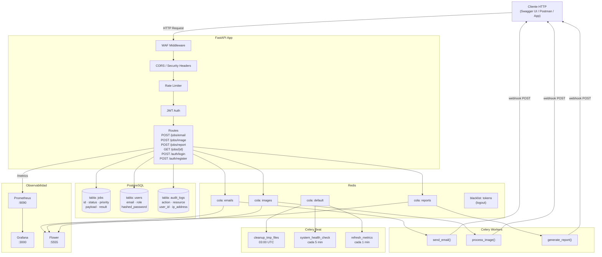
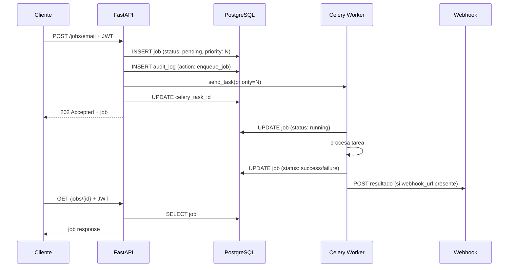

# Task Queue System

Backend asíncrono de procesamiento de tareas construido con Python, Celery y FastAPI. Diseñado con seguridad en todas las capas y orientado a entornos de producción.

---

## Descripción general

El sistema expone una API HTTP que permite encolar tareas de larga duración — envío de emails, procesamiento de imágenes y generación de reportes — para ser procesadas en background por workers independientes. Cada tarea queda registrada en PostgreSQL con su ciclo de vida completo, el estado puede consultarse en cualquier momento, y el sistema notifica proactivamente a los clientes cuando una tarea finaliza mediante webhooks.

---

## Arquitectura



---

## Ciclo de vida de un job



---

## Stack tecnológico

| Componente | Tecnología |
|---|---|
| API | FastAPI + Uvicorn |
| Autenticación | JWT (python-jose) + bcrypt |
| Task Queue | Celery 5 |
| Broker / Backend | Redis 7 |
| Base de datos | PostgreSQL 16 |
| ORM | SQLAlchemy 2 |
| Migraciones | Alembic |
| Validaciones | Pydantic v2 |
| Logging | structlog |
| Métricas | Prometheus + Grafana |
| Monitoreo de workers | Flower |
| Gestor de paquetes | uv |
| Contenedores | Docker + Docker Compose |

---

## Seguridad implementada

**Autenticación y autorización**
- JWT con access token (15 min) y refresh token (7 días)
- Rotación automática de refresh tokens en cada uso
- Blacklist de tokens revocados en Redis — logout real
- Roles `user` y `admin` con dependencias separadas por endpoint
- Contraseñas hasheadas con bcrypt (12 rounds)
- Validación de fortaleza de contraseña (mayúsculas, minúsculas, números, símbolos)
- Mensajes de error genéricos en login — no revela si el email existe

**API (capa HTTP)**
- WAF middleware — detecta y bloquea patrones de SQL injection, XSS, path traversal y null bytes en URL, query string y headers
- Rate limiting por IP con límites diferenciados por endpoint
- Políticas CORS configuradas por entorno
- Security headers en todas las respuestas (HSTS, CSP, X-Frame-Options, etc.)
- Validación de Host header contra lista de hosts permitidos
- Límite de tamaño de body (1MB)

**Datos**
- Sanitización de todos los inputs antes de procesamiento
- ORM obligatorio — nunca SQL crudo
- Validación estricta de schemas con Pydantic en cada endpoint
- Whitelist de operaciones permitidas en tareas de imagen
- Validación de paths para prevenir directory traversal

**Infraestructura**
- Redis protegido con contraseña
- Serialización exclusiva en JSON — pickle deshabilitado en Celery
- Variables de entorno para todas las credenciales
- Archivos temporales con nombres hasheados y limpieza automática

---

## Funcionalidades

### Prioridades en la cola
Cada job puede encolarse con una prioridad del 0 al 9 — donde 0 es la más alta y 9 la más baja. El worker procesa primero los jobs de mayor prioridad independientemente del orden de llegada. El valor por defecto es 5.

```json
{
  "recipient": "usuario@ejemplo.com",
  "subject": "Urgente",
  "body": "Mensaje prioritario.",
  "priority": 0
}
```

### Notificaciones Webhook
Al encolar cualquier job se puede incluir una `webhook_url`. Cuando el worker termina la tarea — ya sea con éxito o fallo — hace un POST a esa URL con el resultado completo. Los reintentos ante fallos transitorios son automáticos (hasta 3 intentos).

```json
{
  "recipient": "usuario@ejemplo.com",
  "subject": "Con webhook",
  "body": "Notificame cuando termine.",
  "webhook_url": "https://mi-servidor.com/webhook"
}
```

El payload que recibe el webhook:
```json
{
  "job_id": "uuid",
  "status": "success",
  "result": { ... },
  "error": null
}
```

### Auditoría de acciones
Todas las acciones relevantes quedan registradas en la tabla `audit_logs` con el usuario, IP, timestamp y datos de contexto. Las acciones auditadas incluyen registro, login, logout y encolado de jobs.

```sql
SELECT action, resource, resource_id, ip_address, created_at
FROM audit_logs
ORDER BY created_at DESC;
```

---

## Observabilidad

### Métricas — Prometheus + Grafana
El endpoint `GET /metrics` expone métricas en formato Prometheus. Grafana consume esas métricas y las visualiza en un dashboard con los siguientes paneles:

| Panel | Métrica | Descripción |
|---|---|---|
| Jobs encolados por tipo | `http_requests_total` | Requests a cada endpoint de encolado |
| Jobs por estado actual | `jobs_by_status` | Conteo de jobs en cada estado |
| Tiempo de respuesta HTTP | `http_request_duration_seconds` | Latencia por endpoint |
| Requests HTTP por endpoint | `http_requests_total` | Volumen de requests |
| Errores y reintentos | `job_errors_total` / `job_retries_total` | Tasa de fallos |

Grafana disponible en `http://localhost:3000`.

### Monitoreo de workers — Flower
Flower disponible en `http://localhost:5555`. Muestra en tiempo real el estado de los workers, las colas, las tareas en ejecución y el historial de tareas completadas o fallidas.

---

## Estructura del proyecto

```
task-queue-system/
├── src/
│   ├── api/
│   │   ├── auth_dependencies.py  # Dependencias require_user / require_admin
│   │   ├── auth_routes.py        # Endpoints /auth (register, login, logout, me)
│   │   ├── dependencies.py       # Validación de Host header
│   │   └── routes.py             # Endpoints /jobs con rate limiting y auditoría
│   ├── core/
│   │   ├── auth.py               # JWT, bcrypt, blacklist de tokens
│   │   ├── config.py             # Settings con Pydantic (carga desde .env)
│   │   ├── cors.py               # Configuración de políticas CORS
│   │   ├── database.py           # Engine, sesión FastAPI y sesión workers
│   │   ├── exceptions.py         # Excepciones del dominio
│   │   ├── logging.py            # Logging estructurado con structlog
│   │   ├── metrics.py            # Definición de métricas Prometheus
│   │   ├── metrics_middleware.py # Middleware de métricas HTTP
│   │   ├── rate_limiter.py       # Configuración de slowapi
│   │   ├── security.py           # Sanitización, validación de archivos y paths
│   │   └── security_middleware.py # WAF y security headers
│   ├── models/
│   │   ├── audit_log.py          # Modelo AuditLog
│   │   ├── base.py               # Base declarativa + TimestampMixin
│   │   ├── job.py                # Modelo Job con priority, enums JobType y JobStatus
│   │   └── user.py               # Modelo User con roles
│   ├── monitoring/
│   │   └── health.py             # Health checks de Redis y DB
│   ├── schemas/
│   │   ├── auth.py               # Schemas de registro, login y tokens
│   │   ├── job.py                # Schemas de respuesta con priority
│   │   └── task_payload.py       # Schemas de entrada con webhook_url y priority
│   ├── services/
│   │   ├── audit_service.py      # Registro de acciones en audit_logs
│   │   ├── auth_service.py       # Lógica de registro, login y tokens
│   │   ├── metrics_service.py    # Actualización de gauges desde la DB
│   │   ├── queue_service.py      # Encolado con prioridad y consulta de jobs
│   │   ├── storage_service.py    # Operaciones seguras sobre el filesystem
│   │   └── webhook_service.py    # Despacho de notificaciones HTTP
│   ├── tasks/
│   │   ├── email_tasks.py        # Tarea de email + BaseTask + update_job_state
│   │   ├── image_tasks.py        # Tarea de procesamiento de imagen
│   │   └── report_tasks.py       # Tareas de reportes + tareas periódicas
│   ├── utils/
│   │   ├── file_utils.py         # Helpers de directorios
│   │   └── validators.py         # Validadores reutilizables (UUID, paginación)
│   └── workers/
│       ├── beat_schedule.py      # Registro de tareas periódicas (legacy)
│       └── celery_app.py         # Instancia, configuración y beat_schedule
├── migrations/                   # Migraciones Alembic
├── tests/
│   ├── integration/
│   │   └── test_health.py
│   └── unit/
│       ├── test_schemas.py
│       ├── test_security.py
│       └── test_validators.py
├── prometheus.yml                # Configuración de scraping
├── .env.example                  # Plantilla de variables de entorno
├── .gitignore
├── celeryconfig.py
├── docker-compose.yml
├── Dockerfile
└── main.py
```

---

## Instalación y puesta en marcha

### Requisitos previos

- Python 3.11+
- [uv](https://docs.astral.sh/uv/)
- Docker y Docker Compose

### 1. Clonar el repositorio

```bash
git clone https://github.com/tu-usuario/task-queue-system.git
cd task-queue-system
```

### 2. Crear el entorno virtual e instalar dependencias

```bash
uv venv .venv
source .venv/bin/activate  # Linux / macOS
# .\.venv\Scripts\Activate.ps1   # Windows PowerShell

uv sync
```

### 3. Configurar variables de entorno

```bash
cp .env.example .env
```

Editá `.env` con tus valores. Los campos que requieren valores propios están marcados con `<...>`. Para generar el `SECRET_KEY`:

```bash
uv run python -c "import secrets; print(secrets.token_hex(32))"
```

### 4. Levantar los servicios con Docker

```bash
docker compose up --build -d
docker compose stop api
```

Esto levanta Redis, PostgreSQL, el worker de Celery, Celery Beat, Flower, Prometheus y Grafana.

### 5. Aplicar las migraciones

```bash
uv run alembic upgrade head
```

### 6. Levantar la API

```bash
uv run uvicorn main:app --reload
```

---

## Uso

La documentación interactiva está disponible en `http://localhost:8000/docs` cuando `DEBUG=true`.

### Flujo básico

**1. Registrarse:**
```bash
curl -X POST http://localhost:8000/auth/register \
  -H "Content-Type: application/json" \
  -H "Host: localhost" \
  -d '{"email": "usuario@ejemplo.com", "password": "MiPass@123"}'
```

**2. Hacer login y obtener el token:**
```bash
curl -X POST http://localhost:8000/auth/login \
  -H "Content-Type: application/json" \
  -H "Host: localhost" \
  -d '{"email": "usuario@ejemplo.com", "password": "MiPass@123"}'
```

**3. Encolar un job con el token:**
```bash
curl -X POST http://localhost:8000/jobs/email \
  -H "Content-Type: application/json" \
  -H "Host: localhost" \
  -H "Authorization: Bearer <access_token>" \
  -d '{
    "recipient": "destino@ejemplo.com",
    "subject": "Asunto",
    "body": "Contenido del mensaje.",
    "priority": 3,
    "webhook_url": "https://mi-servidor.com/webhook"
  }'
```

**4. Consultar el estado:**
```bash
curl http://localhost:8000/jobs/{job_id} \
  -H "Host: localhost" \
  -H "Authorization: Bearer <access_token>"
```

### Endpoints disponibles

**Autenticación**

| Método | Endpoint | Descripción | Rate limit |
|---|---|---|---|
| POST | `/auth/register` | Registrar nuevo usuario | 5/min |
| POST | `/auth/login` | Iniciar sesión | 10/min |
| POST | `/auth/refresh` | Refrescar access token | 10/min |
| POST | `/auth/logout` | Cerrar sesión | 10/min |
| GET | `/auth/me` | Datos del usuario autenticado | — |

**Jobs** *(requieren JWT)*

| Método | Endpoint | Descripción | Rate limit |
|---|---|---|---|
| POST | `/jobs/email` | Encola un envío de email | 10/min |
| POST | `/jobs/image` | Encola procesamiento de imagen | 20/min |
| POST | `/jobs/report` | Encola generación de reporte | 5/min |
| GET | `/jobs/{id}` | Consulta el estado de un job | 60/min |
| GET | `/jobs/{id}/detail` | Detalle completo con payload y resultado | 30/min |

**Sistema**

| Método | Endpoint | Descripción |
|---|---|---|
| GET | `/health` | Health check de la aplicación |
| GET | `/metrics` | Métricas en formato Prometheus |

---

## Tests

```bash
# Todos los tests
uv run pytest tests/ -v

# Solo unitarios
uv run pytest tests/unit/ -v

# Con reporte de cobertura
uv run pytest tests/ -v --cov=src --cov-report=term-missing
```

---

## Variables de entorno

| Variable | Descripción |
|---|---|
| `ENVIRONMENT` | `development`, `staging` o `production` |
| `DEBUG` | Habilita Swagger UI y logs verbose |
| `SECRET_KEY` | Clave secreta para firmar JWT (mínimo 32 caracteres) |
| `REDIS_URL` | URL de conexión a Redis |
| `REDIS_PASSWORD` | Contraseña de Redis |
| `DATABASE_URL` | URL de conexión a PostgreSQL |
| `DB_USER` / `DB_PASSWORD` / `DB_NAME` | Credenciales de PostgreSQL |
| `FLOWER_USER` / `FLOWER_PASSWORD` | Credenciales del panel de Flower |
| `GRAFANA_USER` / `GRAFANA_PASSWORD` | Credenciales del panel de Grafana |
| `MAX_FILE_SIZE_MB` | Tamaño máximo de archivo permitido (default: 10) |
| `CELERY_TASK_MAX_RETRIES` | Reintentos máximos por tarea (default: 3) |

Ver `.env.example` para la lista completa.
